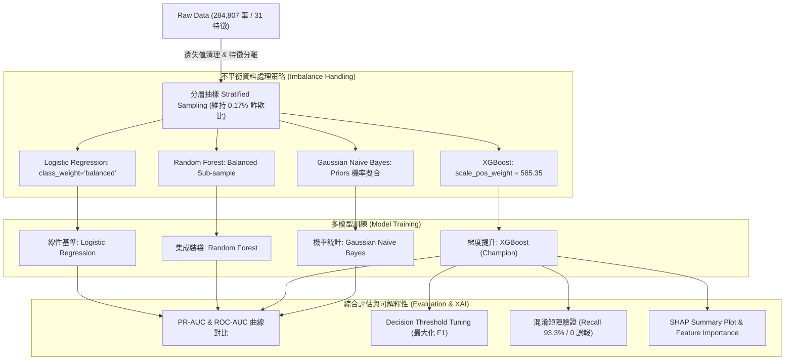

# 基於機器學習之信用卡詐欺偵測系統 (Credit Card Fraud Detection)

[](#)
[](#)
[](#)
[](#)

> **課程專題**：資料科學與機器學習（指導教授：劉譯閔 老師）
> **小組成員**：陳尚恩、簡偉玲、黃鈺方、王海悅、廖冠筑  
> **個人核心職責**：多模型架構選型、不平衡類別權重配置、模型訓練與交叉評估、決策門檻調優 (Decision Threshold Tuning)

---

## 📌 專案背景與痛點 (Problem Statement)
在金融交易情境中，信用卡詐欺偵測面臨兩大核心挑戰：
1. **極端類別不平衡 (Severe Class Imbalance)**：本資料集包含 284,807 筆交易，其中詐欺交易僅佔 **0.17%**（正常交易佔 99.83%）。若單純看準確率（Accuracy），模型全猜正常亦能達到 99.83%，但召回率為 0，毫無實務價值。
2. **非對稱錯誤代價 (Asymmetric Error Cost)**：在金融實務上，「漏判詐欺（False Negative）」帶來的實質金錢損失與法律風險，遠高於「誤判正常（False Positive）」的成本。

---

## 🏗️ 實驗流程架構 (Pipeline Architecture)



---

## 📊 實驗結果與模型性能比較 (Result & Analysis)

針對不平衡資料，捨棄易產生誤導的 Accuracy，以 **PR-AUC、最佳 F1-Score 及其對應之 Recall / Precision** 作為核心評判標準：

| 排名 | 模型名稱 (Model) | ROC-AUC | PR-AUC (基準線: 0.0017) | 最佳 F1-Score | 最佳決策門檻 (Threshold) | Recall @ Best F1 | Precision @ Best F1 |
| :---: | :--- | :---: | :---: | :---: | :---: | :---: | :---: |
| 🏆 **1** | **XGBoost** | **0.9818** | **0.9338** | **0.9333** | **0.822** | **93.33%** | **93.33%** |
| 2 | **Random Forest** | 0.9650 | 0.8306 | 0.9032 | 0.218 | 93.33% | 87.50% |
| 3 | **Logistic Regression** | 0.9573 | 0.8645 | 0.5385 | 0.990 | 93.33% | 37.84% |
| 4 | **Gaussian Naive Bayes** | 0.9941 | 0.1894 | 0.2740 | 0.990 | 66.67% | 17.24% |

*(本表數據為採用 10% 分層抽樣測試集實測所得之精確輸出紀錄)*

### 💡 關鍵洞見 (Key Takeaways)
1. **不平衡資料的評估陷阱 (ROC vs. PR)**：
   * **Naive Bayes** 的 ROC-AUC 達 `0.9941`（看似最佳），但反映少數類別辨識能力的 **PR-AUC 僅有 `0.1894`**。主因是多數類別過多壓低了 FPR，造成 ROC 虛高；PR 曲線則直接揭露特徵獨立假設在金融高度關聯特徵下的不足。
2. **決策門檻調優 (Threshold Tuning)**：
   * 傳統固定 0.5 門檻不適用於不平衡任務。**XGBoost 透過門檻調優至 0.822 時達到 F1 最大值 (0.9333)**，在維持 93.33% 攔截率的同時，成功避免了大量正常交易被誤判。

---

## 📈 視覺化評估與可解釋性 (Evaluation & Explainability)

### 1. 類別分佈與混淆矩陣 (Class Distribution & Confusion Matrix)
| 資料極度不平衡分佈 (0.17% 詐欺) | XGBoost 混淆矩陣 (最佳門檻 0.822) |
| :---: | :---: |
|  |  |
| 正常交易佔 99.83%，詐欺交易僅佔 0.17% | 測試集 15 筆詐欺精準抓到 14 筆 (Recall 93.3%)，且 8,529 筆正常交易零誤報 |

### 2. 評估曲線比對 (ROC Curve vs. PR Curve)
| ROC 曲線比較圖 | Precision-Recall (PR) 曲線比較圖 |
| :---: | :---: |
|  |  |
| 各模型 ROC 表面皆高，但無法區分精準度差異 | **PR 曲線突顯 XGBoost 在高召回率下維持高 Precision 的表現** |

### 3. 模型決策歸因 (Feature Importance & SHAP)
| XGBoost 特徵重要性 (Top 15) | SHAP Summary Plot 歸因分析 |
| :---: | :---: |
|  |  |
| **V10、V12 及 Amount (交易金額)** 為模型決策前三大關鍵因子 | 清楚顯示特徵值高低對預測方向之影響（如 V10 偏低時推動模型判定為詐欺） |

---

## 🛠️ 專案結構 (Directory Structure)

```text
├── docs/
│   └── images/               # 實驗圖表 (分佈圖、混淆矩陣、ROC/PR曲線、SHAP)
├── notebooks/
│   └── credit_card_fraud.ipynb  # 包含資料預處理、訓練與視覺化之完整 Colab 腳本
├── src/
│   ├── preprocess.py         # 分層抽樣與權重計算
│   ├── train.py              # 四大模型訓練流水線
│   └── evaluate.py           # 門檻調優與 PR-AUC 計算
├── requirements.txt          # 相依套件 (xgboost, scikit-learn, shap, matplotlib 等)
└── README.md
```
